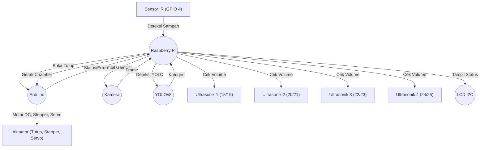

# Smart Trash Bin (Tempat Sampah Otomatis)

## Deskripsi
Sistem tempat sampah otomatis berbasis Raspberry Pi dan Arduino. Raspberry Pi bertugas mendeteksi sampah, mengklasifikasikan jenisnya dengan YOLOv8, serta mengontrol LCD dan sensor volume. Arduino menggerakkan aktuator (tutup, stepper, servo) berdasarkan perintah dari Raspberry Pi.

## Arsitektur Sistem



## Wiring (Asumsi Pin)
- **Sensor IR:** GPIO 4 (Raspberry Pi)
- **Sensor Ultrasonik:**
  - Chamber 1: Trigger 18, Echo 19
  - Chamber 2: Trigger 20, Echo 21
  - Chamber 3: Trigger 22, Echo 23
  - Chamber 4: Trigger 24, Echo 25
- **Kamera:** USB/CSI ke Raspberry Pi
- **LCD I2C:** PCF8574, alamat 0x27
- **Arduino:** Serial USB ke Raspberry Pi
- **Motor DC (Tutup):** Arduino pin 17, 27, limit switch 22
- **Servo (Chamber):** Arduino pin 23
- **Stepper (Chamber):** Arduino pin 5 (step), 6 (dir), limit switch 24/25

## File & Struktur
- `main.py` : Kontrol utama di Raspberry Pi (deteksi, komunikasi, LCD, logging)
- `arduino_controller.ino` : Kontrol aktuator di Arduino
- `config.json` : Konfigurasi pin dan parameter
- `alur.txt` : Dokumentasi alur sistem

## Instalasi & Dependency
### Raspberry Pi
- Python 3
- Library: `RPi.GPIO`, `serial`, `opencv-python`, `ultralytics`, `RPLCD`, `logging`
- Install: 
  ```bash
  pip install RPi.GPIO pyserial opencv-python ultralytics RPLCD
  ```
- Pastikan file `config.json` sudah sesuai wiring Anda.

### Arduino
- Library: Servo (bawaan Arduino IDE)
- Upload `arduino_controller.ino` ke board Arduino

## Cara Menjalankan
1. Pastikan wiring sesuai dengan `config.json` dan README ini.
2. Upload kode ke Arduino.
3. Jalankan `main.py` di Raspberry Pi:
   ```bash
   python3 main.py
   ```
4. Cek file log `smart_trashbin.log` untuk status/error.

## Alur Kerja Singkat
1. Sensor IR mendeteksi sampah, Raspberry Pi perintahkan Arduino membuka tutup.
2. Kamera mengambil gambar, YOLOv8 mendeteksi jenis sampah.
3. Raspberry Pi perintahkan Arduino memindahkan chamber ke posisi sesuai jenis sampah.
4. Servo membuka chamber, sampah jatuh, chamber kembali ke posisi awal.
5. Sensor ultrasonik mengukur volume, LCD menampilkan status.
6. Semua error/status dicatat di log dan LCD.

## Troubleshooting
- Cek wiring jika ada error pin.
- Cek file log untuk detail error.
- Pastikan semua dependency sudah terinstall.

---

Lisensi: Open Source, silakan modifikasi sesuai kebutuhan. 